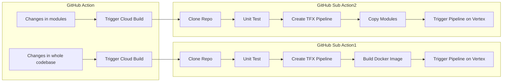
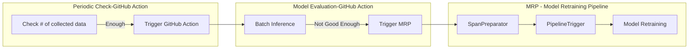

   

# Complete MLOps System Workflow with GCP and TFX

This repository shows how to build a complete MLOps system with [TensorFlow eXtended(TFX)](https://www.tensorflow.org/tfx) and various GCP products such as [Vertex Pipeline](https://cloud.google.com/vertex-ai/docs/pipelines), [Vertex Training](https://cloud.google.com/vertex-ai/docs/training/custom-training), [Vertex Endpoint](https://cloud.google.com/vertex-ai/docs/predictions/deploy-model-api), [Google Cloud Storage](https://cloud.google.com/products/storage/). The main goal is to achieve the two common scenarios of **adapting to changes in codebase** and **adapting to changes in data** over time. To achieve these, we need three separate pipelines:

- **CI/CD pipeline**
  - This pipeline is implemented in TFX, GitHub Action, and Vertex Pipeline.
  - GitHub Action basically detects to any changes occured in codebase. There are two branches of listening. 
  - The detection scope of the **first branch** and the **second branch** are the whole codebase and the only data preprocessing and modeling parts of the whole codebase respectively.
  - Both branches trigger different sub-workflows, but they have a lot in common.
    1. Clones the current codebase
    2. Unit tests the `*_test.py` files
    3. Create TFX pipeline
    4. Run the TFX pipeline in local
    5. Trigger TFX pipeline on Vertex Pipeline
  - The only difference between them is that the **first branch** has additional step to build a new docker image while the **second branch** has copying modules in the cloud location(GCS) in between step **d** and **e**.

- **Model evaluation pipeline**
  - This pipeline is implemented in TFX, GitHub Action, and Vertex Pipeline.
  - GitHub Action periodically checks if there is enough data to evaluate currently deployed model on. The model is released in [GitHub Release](https://docs.github.com/en/repositories/releasing-projects-on-github/managing-releases-in-a-repository).
  - If there is enough data, it triggers another GitHub Action for **Model evaluation**, and it consists of the following:
    - Batch predictions.
    - Evaluate how the predicted result is good or worse by checking with the predefined accuracy threshold.
  - When the predicted result is not good enough, it will launch a Vertex Pipeline written in TFX:
    - SpanPreparator to prepare TFRecord of collected data and put it in different SPAN folder (here different SPAN means a model drift is detected)
    - PipelineTrigger to trigger ML pipeline, and it gives which SPAN to look up for.
  

**👋 NOTE**: One could argue the whole component can be implemented without any cloud services. However, in my opinion, it is non trivial to achieve production ready quality of MLOps system without any help of cloud services. 

## Acknowledgements

I am thankful to the ML Developer Programs team at Google that provided GCP support.
